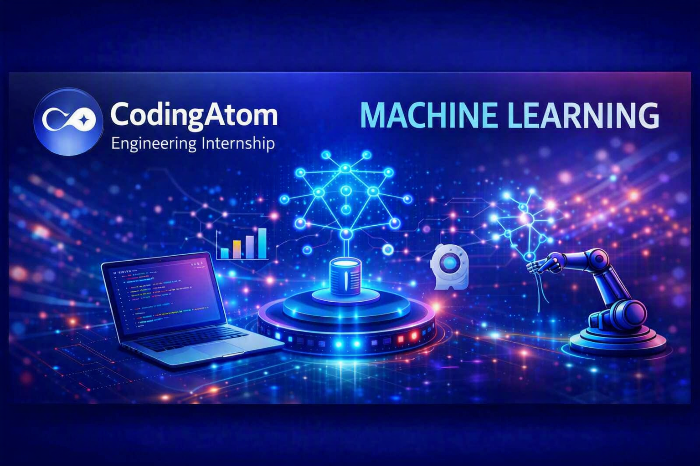
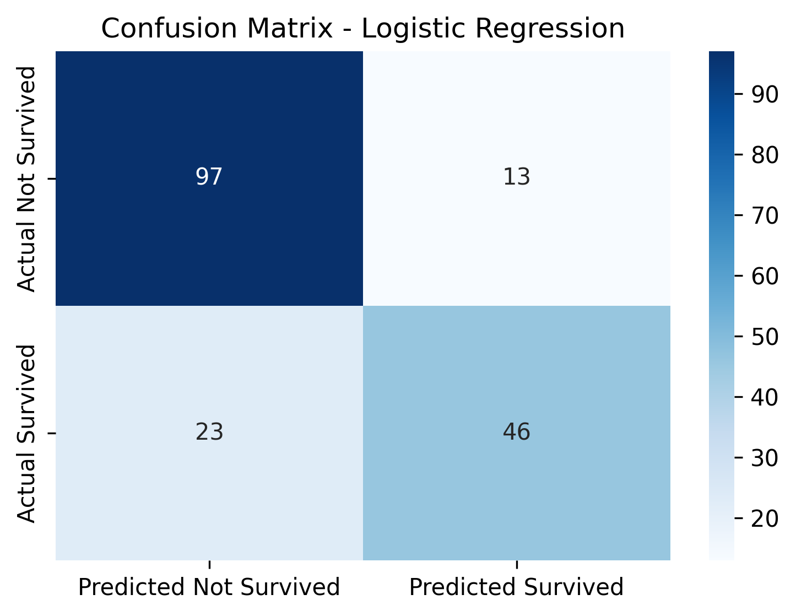
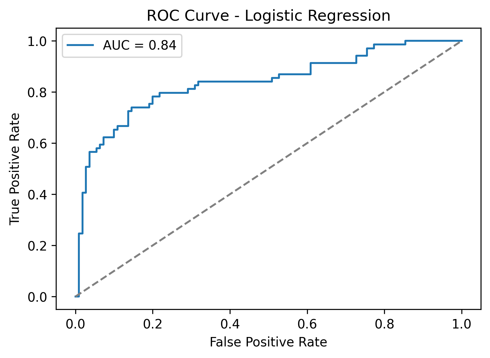
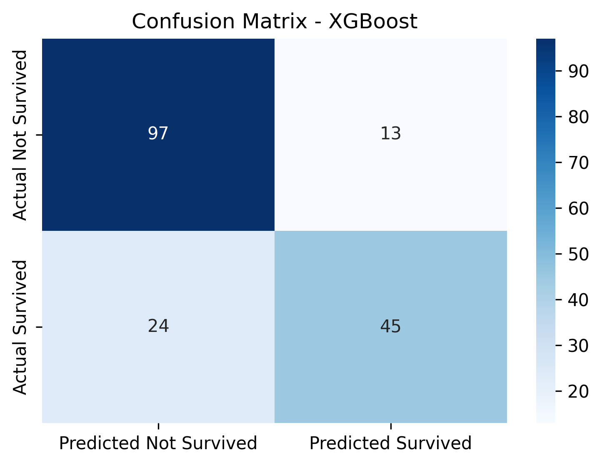
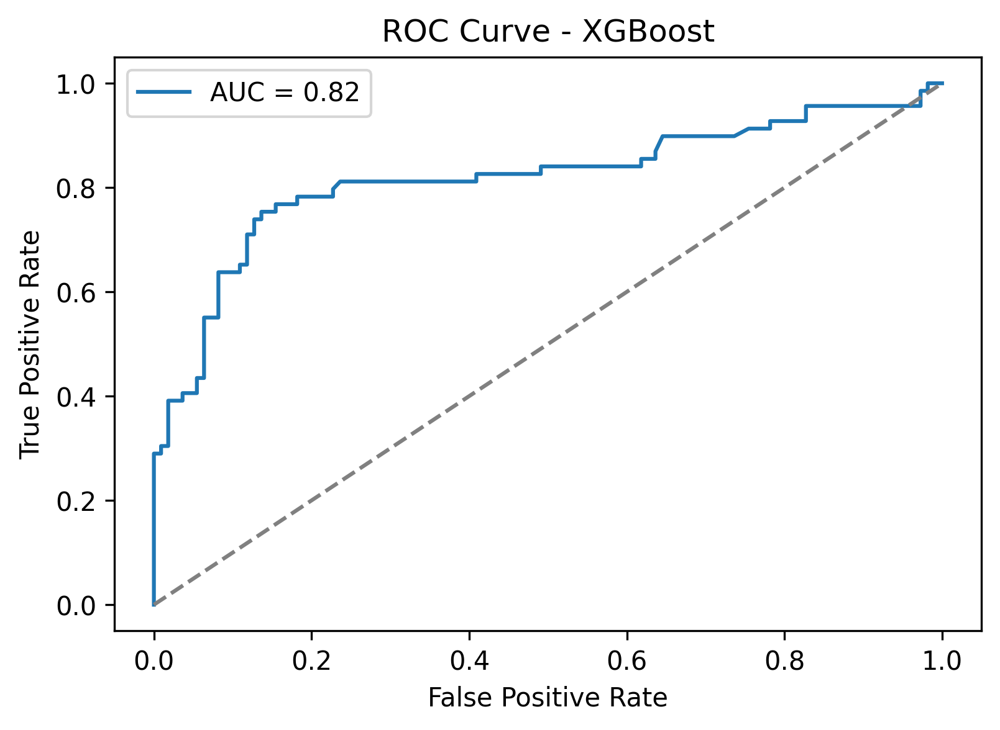
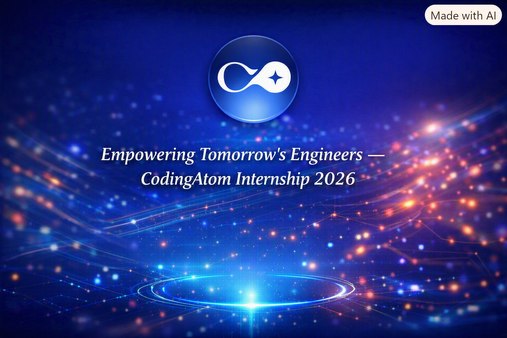

# Titanic Survival Prediction Project

## 📌 Overview

This project explores the classic Titanic dataset to predict passenger survival using two machine learning models:

- Logistic Regression (baseline)

- XGBoost (advanced ensemble method)

The goal is to compare performance between a simple linear model and a more complex gradient boosting model, highlighting the importance of benchmarking against baselines.

---

## ⚙️ Setup

### Requirements

Create a `requirements.txt` file with:

`pandas
numpy
seaborn
matplotlib
scikit-learn
xgboost
joblib`

### Installation

pip install -r requirements.txt

### Dataset

Download the Titanic dataset from Kaggle and place it in the project folder as `Titanic-Dataset.csv`.

[Kaggle Titanic Dataset](https://www.kaggle.com/c/titanic/data)

---

## 🚀 How to Run

1. Open JupyterLab or Jupyter Notebook.

2. Run the notebook cells in order:

- **Setup imports**

- **Load dataset** from `Titanic-Dataset.csv`

- **Data cleaning & feature engineering**

- **Preprocessing pipeline** (numeric scaling + categorical encoding)

- **Train Logistic Regression baseline**

- **Train XGBoost with GridSearchCV**

- **Evaluate models** (classification report, confusion matrix, ROC curve)

- **Save pipelines** with `joblib`

---

## 📊 Results

### Logistic Regression

- Accuracy: **80%**

- Precision (Survived): **0.78**

- Recall (Survived): **0.67**

- F1-score (Survived): **0.72**

### XGBoost

- Accuracy: **79%**

- Precision (Survived): **0.78**

- Recall (Survived): **0.65**

- F1-score (Survived): **0.71**

### Insight

Logistic Regression performed slightly better than XGBoost on this dataset. This demonstrates that **simple models can match or outperform complex ones** — always benchmark before adding complexity.

---

## 📈 Visualizations

### Logistic Regression

### XGBoost

---

## 💾 Saved Models

- `titanic_logreg_pipeline.pkl`

- `titanic_xgb_pipeline.pkl`

Both pipelines include preprocessing + model, making them portable and ready for deployment.

---

## 🔑 Key Insights

- Baselines matter: Logistic Regression ≈ XGBoost.

- Feature engineering (FamilySize, handling missing values) improves performance.

- Pipelines ensure reproducibility and portability.

---

## 👨‍💻 About the Author

**Leonard Phokane**  
— AI/ML student & freelance full‑stack engineer.
Built as part of the **CodingAtom Fullstack Engineering Internship Assessment**.

I enjoy building technical demos, exploring full‑stack projects, and applying machine learning to real‑world problems. Connect with me on [LinkedIn](https://www.linkedin.com/in/leonard-phokane) or check out my GitHub repos for more projects.

